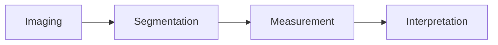
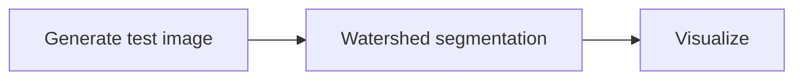

---
jupytext:
  text_representation:
    extension: .md
    format_name: myst
    format_version: 0.13
    jupytext_version: 1.16.4
kernelspec:
  display_name: Python 3 (ipykernel)
  language: python
  name: python3
---

```{code-cell} ipython3
:tags: [hide-cell]

%matplotlib inline
%config InlineBackend.figure_format = 'retina'

import numpy as np
import scipy as sp
import skimage as ski
import matplotlib.pyplot as plt
```

# Part 3: Segmentation

## Splitting an image into regions of interest

--------------

One can think of an image as a projection of a scene, consisting of multiple objects. Sometimes, the scene is considered as a whole, but quite often it is useful to identify the constituent parts, or segments. E.g., we may want to count those segments, or calculate some properties of them. E.g., the number and sizes of cells in a microscopy slide, or the positions and poses of people in a photograph.

Splitting an image into its constituent parts is known as *segmentation*.

<blockquote style="font-size: 120%;"><em>I saw the angel in the marble and carved until I set him free.</em> — Michelangelo (maybe)</blockquote>

Think of Michelangelo, carving the statue of David. The block of marble is *segmented* into foreground and background. In this case, the background is discarded, and only the work of art remains.

To be useful, segmentation has to be followed by *measurement* and *interpretation*. We measure attributes of the segments, and then interpret those measurements to ask some question. Ultimately, we want to know: are the cells healthy, or is the part manufactured correctly, or is the land flooded.



Let's consider that second block, the segmentation algorithm, for a moment.

Scikit-image implements several intuitive, approximate (heuristic) algorithms for segmentation. These are typically *unsupervised*, based on rules around properties of the image / pixels, rather than on labeling examples of objects and non-objects. Neural network approaches, such as U-Net, DeepLab, and Mask R-CNN have proved very effective for segmenting images, given enough training data. These are likely what would be used in practice, unless sufficient labeled data is unavailable.

In terms of this tutorial, we will show the pipeline above, with the understanding that the segmentation algorithm can always be swapped around for something more sophisticated. The results still have to be analysed.

+++

### Representing segmentations

How shall we go about representing segmentations? We already know how to use `numpy` to represent images. Can we use the same concept here?

Yes, we can create a *label* image, of the same size as the segmented image, with each value getting a different value.

Here is a very simple image and segmentation, taken from [this scikit-image gallery example](https://scikit-image.org/docs/dev/auto_examples/segmentation/plot_watershed.html#sphx-glr-auto-examples-segmentation-plot-watershed-py).



```{code-cell} ipython3
# Binary image
smile = np.zeros((40, 40), dtype=bool)

# Left eye
coords = ski.draw.disk((10, 10), 7)
smile[*coords] = True
coords = ski.draw.disk((10, 10), 7)
smile[*coords] = True

# Right eye
coords = ski.draw.disk((10, 30), 7)
smile[*coords] = True

# Mouth
smile[30:35, 5:35] = True
smile[25:30, 5:10] = True
smile[25:30, 30:35] = True

plt.imshow(smile);
```

```{code-cell} ipython3
smile_label = ski.measure.label(smile)
plt.imshow(smile_label);
```

### How do we arrive at label images in practice?

```{code-cell} ipython3
# Generate an initial image with two overlapping circles
x, y = np.indices((80, 80))
x1, y1, x2, y2 = 28, 28, 44, 52
r1, r2 = 16, 20
mask_circle1 = (x - x1)**2 + (y - y1)**2 < r1**2
mask_circle2 = (x - x2)**2 + (y - y2)**2 < r2**2
image = np.logical_or(mask_circle1, mask_circle2)
```

```{code-cell} ipython3
plt.imshow(image);
```

To break these two objects apart, we are going to use *watershed segmentation*.

```{code-cell} ipython3
help(ski.segmentation.watershed)
```

**Signature:**

```python
watershed(image, markers=, mask=, ...)
```

```{code-cell} ipython3
# Generate the markers as local maxima of the distance to the background
distance = sp.ndimage.distance_transform_edt(image)

f, ax = plt.subplots(subplot_kw={"projection": "3d"})
M, N = distance.shape
X, Y = np.meshgrid(np.arange(M), np.arange(N))

ax.view_init(elev=40, azim=-30)
ax.plot_surface(X, Y, distance, cmap='viridis');
```

```{code-cell} ipython3
plt.imshow(distance);
```

```{code-cell} ipython3
# What if we flipped it "upside down"?

f, ax = plt.subplots(subplot_kw={"projection": "3d"})
ax.view_init(elev=40, azim=-30)
ax.plot_surface(X, Y, -distance, cmap='viridis');
```

```{code-cell} ipython3
coords = ski.feature.peak_local_max(distance, footprint=np.ones((3, 3)), labels=image)

f, ax = plt.subplots()
ax.imshow(-distance)
ax.scatter(coords[:, 1], coords[:, 0], marker='x', s=30, c='r')
```

```{code-cell} ipython3
markers = np.zeros_like(distance, dtype=np.uint8)
for n, coord in enumerate(coords):
    print(f"Assigning label {n + 1=} to position {coord=}")
    markers[*coord] = n + 1

# Shorthand:
# markers = ski.util.label_points(coords, distance.shape)

plt.title('"Fountain" positions and labels')
plt.imshow(markers);
```

```{code-cell} ipython3
labels = ski.segmentation.watershed(-distance, markers, mask=image)

# finally, plot the result
fig, ax = plt.subplots(1, 3)
ax[0].imshow(image)
ax[0].set_title('image')
ax[1].imshow(-distance, cmap='gray')
ax[1].set_title('negative\ndistance transform')
ax[1].scatter(coords[:, 1], coords[:, 0], marker='x', s=20, c='red')
ax[2].imshow(labels)
ax[2].set_title('labels');
```

Notice that "labels" is just a NumPy array with integer values. We have to be careful to interpret it as labels and not as an image.

+++

## Counting coins

(Or: what to do once we've segmented an image.)

```{code-cell} ipython3
coins = ski.data.coins()
plt.imshow(coins, cmap='gray');
```

```{code-cell} ipython3
plt.hist(coins.flatten(), bins='auto');
```

```{code-cell} ipython3
plt.imshow(coins > 130);
```

```{code-cell} ipython3
T = ski.filters.threshold_otsu(coins)
T
```

```{code-cell} ipython3
plt.imshow(coins > T);
```

### Exercise: clean up the above image so that we only have coins (solid) and background

You can use, e.g.:

- ski.segmentation.clear_border (to get rid of anything touching the border)
- ski.morphology.remove_small_objects (get rid of noise)
- ski.morphology.closing (to close holes)

<div style="color: red; font-weight: bold; margin-bottom: 50rem;">The answer follows; don't scroll down before you've tried it yourself!</span>

```{code-cell} ipython3
fg = coins > T
fg_no_border = ski.segmentation.clear_border(fg)
fg_no_small = ski.morphology.remove_small_objects(fg_no_border)
fg_closed = ski.morphology.closing(fg_no_small, footprint=ski.morphology.disk(3))

f, axes = plt.subplots(1, 4, figsize=(10, 3))

for ax in axes:
    ax.axis('off')

axes[0].imshow(fg)
axes[1].imshow(fg_no_border)
axes[2].imshow(fg_no_small)
axes[3].imshow(fg_closed);
```

We lost one coin :/ Would have done better with a better segmentation algorithm, but also a valuable lesson: controlling imaging conditions is much easier than fixing such problems with algorithms later on.

+++

But, OK, we have coins!

+++

### Region properties

Exercise: count the coins! Using code :)

Hint: change the binary coins image into a label image first, using `ski.measure.label`.

<div style="color: red; font-weight: bold; margin-bottom: 50rem;">The answer follows; don't scroll down before you've tried it yourself!</span>

```{code-cell} ipython3
coin_labels = ski.measure.label(fg_closed)

f, axes = plt.subplots(1, 3, figsize=(10, 3))
for ax in axes:
    ax.axis('off')
axes[0].imshow(coins, cmap='gray')
axes[0].set_title('Coins')
axes[1].imshow(fg_closed)
axes[1].set_title('Foreground mask')
axes[2].imshow(coin_labels)
axes[2].set_title('Labels');
```

```{code-cell} ipython3
f, axes = plt.subplots(1, 5, figsize=(10, 3))

for i, ax in enumerate(axes):
    ax.axis('off')
    ax.imshow(coin_labels == i)
```

```{code-cell} ipython3
print("Total regions (nr of coins):", np.max(coin_labels))
```

```{code-cell} ipython3
# Enter a powerful new tool: region properties

regions = ski.measure.regionprops(coin_labels)
```

```{code-cell} ipython3
regions[0]
```

```{code-cell} ipython3
print("Number of coins:", len(regions))
```

```{code-cell} ipython3
print("Average coin size in pixels:", np.mean([r.area for r in regions]))
```

```{code-cell} ipython3
print("Max coin size in pixels:", np.max([r.area for r in regions]))
```

See https://scikit-image.org/docs/stable/api/skimage.measure.html#skimage.measure.regionprops or `help(ski.measure.regionprops)` for the full list of properties.

```{code-cell} ipython3
rp = ski.measure.regionprops_table(coin_labels, properties=('label', 'area', 'centroid', 'eccentricity'))
rp
```

```{code-cell} ipython3
import pandas as pd
pd.DataFrame(rp).head()
```

<div style="margin-top: 30rem;">
    
## Segmenting nuclei and measuring cell properties

This example repeats the steps above, but on a 3D dataset, using Napari for interactive visualization and marker annotation. It is accompanied by narrative documentation, so that you can try it by yourself after the tutorial.

<span style="color: red; font-weight: bold;">NOTE: Napari does not run in a JupyterLite (web) installation; you will have to install Python locally first, as well as the tutorial dependencies:

```sh
python -m pip install -r requirements/jupyterlite.txt
```

+++

----

In the rest of this notebook, we will segment cell nuclei from a small sample image provided by the Allen Institute for Cell Science.

```{code-cell} ipython3
cells3d = ski.data.cells3d()
```

```{code-cell} ipython3
cells3d.shape  # z, color, y, x
```

```{code-cell} ipython3
cells3d.dtype
```

```{code-cell} ipython3
np.max(cells3d)
```

The pixel spacing in this dataset is 0.29µm in the z (leading!) axis, and 0.26µm in the x and y axes.

```{code-cell} ipython3
spacing = np.array([0.29, 0.26, 0.26])
```

We can view the 3D image using napari.

```{code-cell} ipython3
import napari
from napari.utils import nbscreenshot

viewer, (membrane_layer, nuclei_layer) = napari.imshow(
    cells3d,
    channel_axis=1,  # remember, Python uses 0-based indexing!
    scale=spacing,
    name=['membranes', 'nuclei'],
    ndisplay=3,
)
```

```{code-cell} ipython3
:tags: [hide-input]

viewer.dims.ndisplay = 3
viewer.camera.angles = (-30, 25, 120)
nbscreenshot(viewer, canvas_only=True)
```

## Edge detection

We saw the [Sobel operator](https://en.wikipedia.org/wiki/Sobel_operator) in the filters lesson. It is an edge detection algorithm that approximates the gradient of the image intensity, and is fast to compute. The [Scharr filter](https://scikit-image.org/docs/dev/api/skimage.filters.html#skimage.filters.scharr) is a slightly more sophisticated version, with smoothing weights [3, 10, 3]. Finally, the Farid & Simoncelli filter has [even more sophisticated weights](https://en.wikipedia.org/wiki/Image_derivative#Farid_and_Simoncelli_Derivatives). All three work for n-dimensional images in scikit-image.

```{code-cell} ipython3
# grab individual channels and convert to float in [0, 1]

membranes = cells3d[:, 0, :, :] / np.max(cells3d)
nuclei = cells3d[:, 1, :, :] / np.max(cells3d)
```

```{code-cell} ipython3
edges = ski.filters.farid(nuclei)

edges_layer = viewer.add_image(
    edges,
    scale=spacing,
    blending='additive',
    colormap='yellow',
)
```

```{code-cell} ipython3
:tags: [hide-input, remove-input]

nbscreenshot(viewer)
```

## Thresholding

[Thresholding](https://en.wikipedia.org/wiki/Thresholding_%28image_processing%29) is used to create binary images. A threshold value determines the intensity value separating foreground pixels from background pixels. Foregound pixels are pixels brighter than the threshold value, background pixels are darker. In many cases, images can be adequately segmented by thresholding followed by labelling of *connected components*, which is a fancy way of saying "groups of pixels that touch each other".

Different thresholding algorithms produce different results. [Otsu's method](https://en.wikipedia.org/wiki/Otsu%27s_method) and [Li's minimum cross entropy threshold](https://scikit-image.org/docs/dev/auto_examples/developers/plot_threshold_li.html) are two common algorithms. Below, we use Li. You can use `skimage.filters.threshold_<TAB>` to find different thresholding methods.

```{code-cell} ipython3
denoised = sp.ndimage.median_filter(nuclei, size=3)
```

```{code-cell} ipython3
li_thresholded = denoised > ski.filters.threshold_li(denoised)
```

```{code-cell} ipython3
threshold_layer = viewer.add_image(
    li_thresholded,
    scale=spacing,
    opacity=0.3,
)
```

```{code-cell} ipython3
:tags: [hide-input]

nbscreenshot(viewer)
```

We can see that the thresholded value is full of small holes, because of variation in pixel intensity inside the nuclei. Before proceeding further, we'd like to clean up those holes. Additionally, because of variations in the *background* intensity, some spurious small clumps of background pixels appear as foreground.

+++

## Morphological operations

+++

[Mathematical morphology](https://en.wikipedia.org/wiki/Mathematical_morphology) operations and structuring elements are defined in `skimage.morphology`. Structuring elements are shapes which define areas over which an operation is applied. The response to the filter indicates how well the neighborhood corresponds to the structuring element's shape.

There are a number of two and three dimensional structuring elements defined in `skimage.morphology`. Not all 2D structuring element have a 3D counterpart. The simplest and most commonly used structuring elements are the `disk`/`ball` and `square`/`cube`.

+++

Functions operating on [connected components](https://en.wikipedia.org/wiki/Connected_space) can remove small undesired elements while preserving larger shapes.

`skimage.morphology.remove_small_holes` fills holes and `skimage.morphology.remove_small_objects` removes bright regions. Both functions accept a size parameter, which is the minimum size (in pixels) of accepted holes or objects. It's useful in 3D to think in linear dimensions, then cube them. In this case, we remove holes / objects of the same size as a cube 20 pixels across.

```{code-cell} ipython3
width = 20

remove_holes = ski.morphology.remove_small_holes(
    li_thresholded, width ** 3
)
```

```{code-cell} ipython3
width = 20

remove_objects = ski.morphology.remove_small_objects(
    remove_holes, width ** 3
)

viewer.add_image(
    remove_objects,
    name='cleaned',
    scale=spacing,
    opacity=0.3,
);

viewer.layers['li_thresholded'].visible = False
```

```{code-cell} ipython3
:tags: [hide-input]

nbscreenshot(viewer)
```

## Segmentation

+++

Now we are ready to label the connected components of this image.

```{code-cell} ipython3
labels = ski.measure.label(remove_objects)

viewer.add_labels(
    labels,
    scale=spacing,
    opacity=0.5,
)

viewer.layers['cleaned'].visible = False
```

```{code-cell} ipython3
:tags: [hide-input]

nbscreenshot(viewer)
```

We can see that tightly packed cells connected in the binary image are assigned the same label.

+++

A better segmentation would assign different labels to different nuclei. 

Typically we use [watershed segmentation](https://en.wikipedia.org/wiki/Watershed_%28image_processing%29) for this purpose. We place *markers* at the center of each object, and these labels are expanded until they meet an edge or an adjacent marker.

The trick, then, is how to find these markers.

A common approach, which we saw above with the two overlapping circles, is to compute the distance transform of a binary mask, and place markers at the local maxima of that transform.

As you will see below, it can be quite challenging to find markers with the right location. A slight amount of noise in the image can result in very wrong point locations.

```{code-cell} ipython3
transformed = sp.ndimage.distance_transform_edt(
    remove_objects, sampling=spacing
)

maxima = ski.morphology.local_maxima(transformed)
viewer.add_points(
    np.transpose(np.nonzero(maxima)),
    name='bad points',
    scale=spacing,
    size=4,
    n_dimensional=True,  # points have 3D "extent"
)
```

```{code-cell} ipython3
:tags: [hide-input]

nbscreenshot(viewer)
```

You can see that these points are actually terrible, with many markers found within each nuclei.

+++

### Exercise 1: improve the points

Try to improve the segmentation to assign one point for each nucleus. Some ideas:

- use a smoothed version of the nuclei image directly
- smooth the distance map
- use morphological operations to smooth the surface of the nuclei to ensure that they are close to spherical
- use peak_local_max with `min_distance` parameter instead of `morphology.local_maxima`
- find points on a single plane, then prepend the plane index to the found coordinates

```{code-cell} ipython3
# Solution here
```

### Mixing manual annotation and algorithms

+++

As you will have seen from the previous exercise, there are many approaches to find better seed points, but they are often fiddly and tedious, and sensitive to parameters — when you encounter a new image, you might have to start all over again!

With napari, in many cases, a little interactivity, combined with the segmentation algorithms in scikit-image and elsewhere, can quickly get us the segmentation we want.

Below, you can use full manual annotation, or light editing of the points you found automatically.

```{code-cell} ipython3
viewer.layers['bad points'].visible = False
viewer.dims.ndisplay = 2
viewer.dims.set_point(0, 30 * spacing[0])

points = viewer.add_points(
    name='interactive points',
    scale=spacing,
    ndim=3,
    size=4,
    n_dimensional=True,
)
points.mode = 'add'


# now, we annotate the centers of the nuclei in your image
```

```{code-cell} ipython3
:tags: [remove-input]

viewer.dims.ndisplay = 3
viewer.camera.angles = (-30, 25, 120)
nbscreenshot(viewer)
```

```{code-cell} ipython3
:tags: [hide-cell, remove-input, remove-output]

# unscaled points.data
# this cell is only to simulate interactive annotation,
# no need to run it if you already have annotations.
# If for some reason you don't, you can uncomment the code below


# points.data = np.array(
#       [[ 30.        ,  14.2598685 ,  27.7741219 ],
#        [ 30.        ,  30.10416663,  81.36513029],
#        [ 30.        ,  13.32785096, 144.27631406],
#        [ 30.        ,  46.8804823 , 191.80920846],
#        [ 30.        ,  43.15241215, 211.84758551],
#        [ 30.        ,  94.87938547, 160.12061219],
#        [ 30.        ,  72.97697335, 112.58771779],
#        [ 30.        , 138.21820096, 189.01315585],
#        [ 30.        , 144.74232372, 242.60416424],
#        [ 30.        ,  98.14144685, 251.92433962],
#        [ 30.        , 153.59649032, 112.58771779],
#        [ 30.        , 134.49013081,  40.35635865],
#        [ 30.        , 182.95504275,  48.74451649],
#        [ 30.        , 216.04166532,  80.89912152],
#        [ 30.        , 235.14802483, 130.296051  ],
#        [ 30.        , 196.00328827, 169.44078757],
#        [ 30.        , 245.86622651, 202.06140137],
#        [ 30.        , 213.71162148, 250.52631331],
#        [ 28.        ,  87.42324517,  52.00657787]],
#       dtype=float,
# )
```

Once you have marked all the points, you can grab the data back, and make a markers image for `skimage.segmentation.watershed`:

```{code-cell} ipython3
marker_locations = points.data


markers = ski.util.label_points(marker_locations, nuclei.shape)
markers_big = ski.morphology.dilation(markers, morphology.ball(5))

segmented = ski.segmentation.watershed(
    edges,
    markers_big,
    mask=remove_objects,
)

final_segmentation = viewer.add_labels(
    segmented,
    scale=spacing,
    blending='translucent_no_depth',  # don't hide enclosed points
)

viewer.layers['labels'].visible = False
```

```{code-cell} ipython3
:tags: [remove-input]

nbscreenshot(viewer)
```

After watershed, we have better disambiguation between internal cells!

+++

## Making measurements

+++

Once we have defined our objects, we can make measurements on them using `skimage.measure.regionprops` and `skimage.measure.regionprops_table`. These measurements include features such as area or volume, bounding boxes, and intensity statistics.

Before measuring objects, it helps to clear objects from the image border. Measurements should only be collected for objects entirely contained in the image.

Given the layer-like structure of our data, we only want to clear the objects touching the sides of the volume, but not the top and bottom, so we pad and crop the volume along the 0th axis to avoid clearing the mitotic nucleus.

```{code-cell} ipython3
segmented_padded = np.pad(
    segmented,
    ((1, 1), (0, 0), (0, 0)),
    mode='constant',
    constant_values=0,
)
```

```{code-cell} ipython3
interior_labels = ski.segmentation.clear_border(segmented_padded)[1:-1]
```

`skimage.measure.regionprops` automatically measures many labeled image features. Optionally, an `intensity_image` can be supplied and intensity features are extracted per object. It's good practice to make measurements on the original image.

Not all properties are supported for 3D data. Below we build a list of supported and unsupported 3D measurements.

```{code-cell} ipython3
regionprops = ski.measure.regionprops(interior_labels, intensity_image=nuclei)

supported = [] 
unsupported = []

for prop in regionprops[0]:
    try:
        regionprops[0][prop]
        supported.append(prop)
    except NotImplementedError:
        unsupported.append(prop)

print("3D/nD properties:")
print("  " + "\n  ".join(supported))
print()
print("2D-only properties:")
print("  " + "\n  ".join(unsupported))
```

scikit-image 0.18 adds support for [passing custom functions](https://scikit-image.org/docs/dev/api/skimage.measure.html#skimage.measure.regionprops) for region properties as `extra_properties`. After this tutorial, you might want to try it out to [determine the surface area](https://github.com/scikit-image/scikit-image/issues/3797#issuecomment-471277056) of the nuclei or cells!

+++

`skimage.measure.regionprops` ignores the 0 label, which represents the background.

+++

`regionprops_table` returns a dictionary of columns compatible with creating a pandas dataframe of properties of the data:

```{code-cell} ipython3
import pandas as pd


info_table = pd.DataFrame(
    ski.measure.regionprops_table(
        interior_labels,
        intensity_image=nuclei,
        properties=['label', 'slice', 'area', 'mean_intensity', 'solidity'],
    )
).set_index('label')
```

```{code-cell} ipython3
info_table.head()
```

We can now use pandas and seaborn for some analysis!

```{code-cell} ipython3
import seaborn as sns

sns.scatterplot(x='area', y='solidity', data=info_table, hue='mean_intensity');
```

We can see that the mitotic nucleus is a clear outlier from the others in terms of solidity and intensity.

+++

### Exercise 2: physical measurements

The "area" property above is actually the volume of the region, measured in voxels. Add a new column to your dataframe, `'area_um3'`, containing the volume in µm&sup3;. *Hint: remember the voxel spacing we noted at the start of the tutorial. You only need pandas to do this.*

```{code-cell} ipython3
# Solution here
```

### Exercise 3: displaying regionprops (or other values)

Now that you have segmented cells, (or even with just the nuclei), use [`skimage.util.map_array`](https://scikit-image.org/docs/dev/api/skimage.util.html#skimage.util.map_array) to display a volume of the value of a regionprop (say, 'solidity' of the cells) on top of the segments.

```{code-cell} ipython3
# Solution here
```
